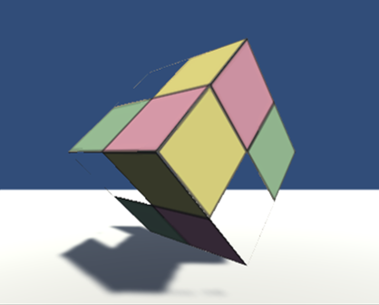

在之前的记录中已经知道了透明度测试的原理。本节主要就在Unity中通过透明度测试实现透明效果进行实践。


**原理回顾**

透明度测试采用一种“非舍即留”的机制，即，若某片元的透明度不满足条件(通常小于某个阈值)，则舍弃；否则就按照不透明物体去处理。也就是说，透明度测试是不关闭深度写入的。它产生的结果要么完全透明，看不到；要么完全不透明，与其他不透明物体一样。


> 通常，使用clip函数在片元着色器中进行透明度测试。clip是CG的一个函数，其参数是裁剪时使用的标量或矢量条件。若，给定参数的任何一个分量是负数，就会舍弃当前像素的输出颜色。


**实践**


- 运行平台：

    **Unity 2018.4.2f1 (64-bit)**

- 项目地址：

    [Unity_Shader_GetIn](https://github.com/wonderly321/Unity_Shader_GetIn)


**准备工作**


1. 在Unity中新建一个场景，命名为Scene_8_3。默认场景中将包含一个摄像机和一个平行光，并使用内置的天空盒子。为便于查看效果，在`Window->Rendering->Lighting Seting->Skybox`中去掉场景中的天空盒子。
2. 新建Shader(右键`Create->Shader->任一个Shader`)并命名为AlphaTest；新建材质(右键`Create->Material`)并命名为AlphaTestMat，将新建的Shader拖拽赋给新建材质。
3. 在场景中创建一个立方体，并拖拽到合适位置，将其材质修改为新建材质。
4. 保存场景。

其他准备：一张透明纹理，其中每个方格的透明度不同（从左到右，从上到下依次是80%，70%，60%，50%）


**Shader实现**:

打开新建的AlphaTest，删除所有已有代码并写入如下代码：

```glsl
Shader "Custom/AlphaTest" {
	Properties {
		_Color ("Color Tint", Color) = (1, 1, 1, 1)
		_MainTex ("Main Tex", 2D) = "white" {}
		//声明控制透明度测试时使用的阈值，其范围为[0,1]
		_Cutoff ("Alpha Cutoff", Range(0, 1)) = 0.5
	}
	SubShader {
		Tags {"Queue"="AlphaTest" "IgnoreProjector"="True" "RenderType"="TransparentCutout"}
		//RenderType标签可以让这个Unity把这个Shader归入到提前定义的组中
		//通常，使用透明度测试的shader都应该在SubShader中设置这三个标签
		
		Pass {
			Tags { "LightMode"="ForwardBase" }
			
			CGPROGRAM
			
			#pragma vertex vert
			#pragma fragment frag
			
			#include "Lighting.cginc"
			
			fixed4 _Color;
			sampler2D _MainTex;
			float4 _MainTex_ST;
			fixed _Cutoff;//由于其范围是[0,1]，所以可以用fixed精度来存储
			
			struct a2v {
				float4 vertex : POSITION;
				float3 normal : NORMAL;
				float4 texcoord : TEXCOORD0;
			};
			
			struct v2f {
				float4 pos : SV_POSITION;
				float3 worldNormal : TEXCOORD0;
				float3 worldPos : TEXCOORD1;
				float2 uv : TEXCOORD2;
			};
			
			v2f vert(a2v v) {
				v2f o;
				o.pos = UnityObjectToClipPos(v.vertex);
				//在顶点着色器中计算出世界空间下的法线方向和顶点位置以及变换后的坐标
				o.worldNormal = UnityObjectToWorldNormal(v.normal);
				
				o.worldPos = mul(unity_ObjectToWorld, v.vertex).xyz;
				
				o.uv = TRANSFORM_TEX(v.texcoord, _MainTex);
				
				return o;
			}
			
			fixed4 frag(v2f i) : SV_Target {
				fixed3 worldNormal = normalize(i.worldNormal);
				fixed3 worldLightDir = normalize(UnityWorldSpaceLightDir(i.worldPos));
				
				fixed4 texColor = tex2D(_MainTex, i.uv);
				
				// Alpha test 若texColor.a小于_Cutoff,则物体完全透明
				clip (texColor.a - _Cutoff);
				
				
				fixed3 albedo = texColor.rgb * _Color.rgb;
				
				fixed3 ambient = UNITY_LIGHTMODEL_AMBIENT.xyz * albedo;
				
				fixed3 diffuse = _LightColor0.rgb * albedo * max(0, dot(worldNormal, worldLightDir));
				
				return fixed4(ambient + diffuse, 1.0);
			}
			
			ENDCG
		}
	} 
	//使用内置VertexLit来回调shader，不仅可以保证在我们编写的SubShader无法在当前显卡上工作时可以有合适的替代shader,还可以保证使用透明度测试的物体可以正确的向其他物体投射阴影
	FallBack "Transparent/Cutout/VertexLit"
}
```


保存返回后，使用之前准备的透明纹理，并调节cutoff参数可以得到如下效果：

|  |  |  |
| :------------------------------------------: | :------------------------------------------: | :------------------------------------------: |
|                 Alpha = 0.55                 |                 Alpha = 0.65                 |                 Alpha = 0.75                 |


从图中可以看出，透明度测试得到的透明效果很“极端”，随着Alpha cutoff参数的增大，更多的像素由于不满足透明度测试条件而被剔除，其效果就像不透明物体上出现了空洞。而且边缘处层次不齐有锯齿。

因而下一部分将使用一种更为柔和的方式——透明度混合来实现透明效果~


**双面渲染**

在现实生活中，若一个物体是透明的，意味着我们不仅可以透过它看到其他物体的样子，也应该可以看到它内部的结构。但在之前实现的透明度测试中，无法得到这样的效果，导致物体看起来只有半个。这是因为默认情况下渲染引擎剔除了物体背面的渲染图元。若要得到双面渲染的效果，可以使用Cull指令来控制需要剔除哪个面的渲染图元。

> Unity中Cull指令的语法如下：
>
> ​	Cull  Back | Front | Off
>
> 设置为Back则背面不渲染，其他同理。需要注意的是设置为**Off**时，渲染图元数目会成倍增加，因此通常情况下不会设置为**Off**


那么如何实现呢？

很简单，只需新建一个AlphaTestBothSideMat和对应得AlphatTestBothSide Shader的代码并复制粘贴AlphaTest代码，在pass中添加一行:

```GLSL
Pass {
	Tags { "LightMode"="ForwardBase"}
	
	//Turn off culling
	Cull off

```

此时我们可以透过镂空区域看到立方体内部的结构，效果如下：

|  |  |  |
| :------------------------------------------: | :------------------------------------------: | :------------------------------------------: |
|                 Alpha = 0.55                 |                 Alpha = 0.65                 |                 Alpha = 0.75                 |


### 参考

[Unity_Shaders_Book : https://github.com/candycat1992/Unity_Shaders_Book](https://github.com/candycat1992/Unity_Shaders_Book)

[Unity Scripting Reference : https://docs.unity3d.com/ScriptReference/index.html](https://docs.unity3d.com/ScriptReference/index.html)

[Unity Manual: https://docs.unity3d.com/Manual/TextureTypes.html](https://docs.unity3d.com/Manual/TextureTypes.html)