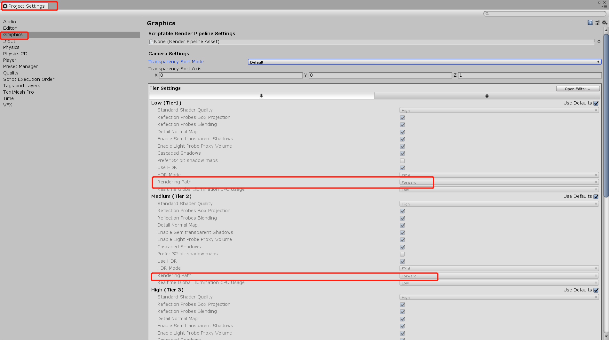
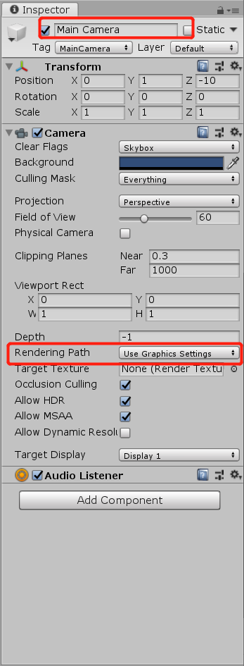

在前面的所有实践中，我们的场景中都仅有一个光源且光源类型是平行光。但在实际的游戏开发过程中，往往需要处理数目更多，类型更复杂的光源。更重要的是，我们需要得到阴影。

那么Unity 的底层渲染引擎是如何处理光源的呢？那我们就有必要先了解一下Unity的渲染路径。因为渲染路径决定了光照是如何应用到UnityShader中的。只有为Shader正确地选择和设置了需要的渲染路径，该Shader的光照计算才能被正确执行。

Unity提供了多个内置的渲染路径，他们是根据`Graphics Settings` 或者`Camera`的设置，而`Camera`可以覆盖`Graphics Settings`。默认情况下，该设置选择的是前向渲染路径（`Forward`）。




但有时对于具体的场景来说，不同的物体对象需要使用不同的渲染路径，因此`Camera`内的渲染路径设置对`GraphicSetting`的覆盖就可以完美的解决这个问题。



需要注意的是，如果当前的显卡并不支持所选择的渲染路径，Unity会自动使用更低一级的渲染路径。完成上面的设置后，我们就可以在每个Pass中使用标签来指定该Pass的渲染路径，具体语法是通过设置标签`LightMode`来实现。

接下来，列举一下Unity提供的各种渲染路径和它们的特点。

| 名称                             | 中文名称         | 描述                                                         |
| -------------------------------- | ---------------- | ------------------------------------------------------------ |
| Deffered Shading                 | 延迟渲染路径     | 具有最高光照和阴影保真度的渲染路径，最适合于具有许多实时光源的情况。它需要一定水平的硬件支持。 |
| Forward Shading                  | 前向渲染路径     | 前向渲染是传统的渲染路径。它支持所有典型的Unity图形功能（法线贴图（normal maps），逐像素光源(pixel lights)，阴影(shadows)等）。但是，在默认设置下，逐像素光照模式下仅渲染少数最亮的光源。其余的灯光是在对象顶点(object vertices)或每个对象(per-object)处计算的。 |
| Legacy Deferred（light prepass） | 旧版延迟渲染     | 旧版Deferred Shading，类似于Deferred Shading，只是使用了一种具有不同权衡的技术。它不支持基于Unity 5物理的标准着色器(standard shader)。 |
| Legacy Vertex Lit                | 旧版顶点光照渲染 | 旧版Vertex Lit，具有最低光照保真度且不支持实时阴影的渲染路径。它其实是正向渲染（Forward Shading）路径的子集。 |

注意： 使用正交投影时，不支持延迟渲染。如果照相机的投影模式设置为“正交”，则这些值将被覆盖，并且照相机将始终使用前向渲染。 

更具体的比较，引用UnityManual给出的表格：

| Name                                            | Deferred                                                     | Forward                                                 | Legacy Deferred                     | Vertex Lit     |
| :---------------------------------------------- | :----------------------------------------------------------- | :------------------------------------------------------ | :---------------------------------- | -------------- |
| Per-pixel lighting (normal maps, light cookies) | Yes                                                          | Yes                                                     | Yes                                 | -              |
| Realtime shadows                                | Yes                                                          | With caveats                                            | Yes                                 | -              |
| **Reflection Probes**                           | Yes                                                          | Yes                                                     | -                                   | -              |
| Depth&Normals Buffers                           | Yes                                                          | Additional render passes                                | Yes                                 | -              |
| **Soft Particles**                              | Yes                                                          | -                                                       | Yes                                 | -              |
| Semitransparent objects                         | -                                                            | Yes                                                     | -                                   | Yes            |
| Anti-Aliasing                                   | -                                                            | Yes                                                     | -                                   | Yes            |
| Light **Culling Masks**                         | Limited                                                      | Yes                                                     | Limited                             | Yes            |
| Lighting Fidelity                               | All per-pixel                                                | Some per-pixel                                          | All per-pixel                       | All per-vertex |
| **Performance**                                 |                                                              |                                                         |                                     |                |
| Cost of a per-pixel Light                       | Number of **pixels**  it illuminates                         | Number of **pixels** * Number of objects it illuminates | Number of **pixels** it illuminates | -              |
| Number of times objects are normally rendered   | 1                                                            | Number of per-pixel lights                              | 2                                   | 1              |
| Overhead for simple **scenes**                  | High                                                         | None                                                    | Medium                              | None           |
| **Platform Support**                            |                                                              |                                                         |                                     |                |
| PC (Windows/Mac)                                | **Shader**  Model 3.0+ & MRT                                 | All                                                     | **Shader** Model 3.0+               | All            |
| Mobile (iOS/Android)                            | OpenGL ES 3.0 & MRT, Metal (on devices with A8 or later SoC) | All                                                     | OpenGL ES 2.0                       | All            |
| Consoles                                        | XB1, PS4                                                     | All                                                     | XB1, PS4, 360                       | -              |

在实际应用中选择哪一种渲染路径，主要根据**灯光的数量**和**平台**来决定。

#### 设置Pass标签

在上面的篇幅中已经提到过，渲染路径的使用是通过设置Pass内的Tag来实现的。`LightMode`用来定义该Pass在光照管道中的角色，其语法类似键值对：

```  Tags { "TagName1" = "Value1" "TagName2" = "Value2" } ```

 指定**TagName1**具有**Value1**，**TagName2**具有**Value2**。您可以根据需要拥有任意数量的标签。 


通常有以下类别：

- **Always**:无论使用哪种渲染路径，该Pass总是会被渲染，但不会计算任何光照
- **ForwardBase**: 用于前向渲染。该Pass会计算环境光、最重要的平行光、逐顶点/SH光源和光照贴图（Lightmaps）
- **ForwardAdd**: 用于前向渲染。该Pass会计算额外的逐像素光源，每个Pass对应一个光源
- **Deferred**: 用于延迟渲染。该Pass会渲染G-缓冲（G-buffer）
- **ShadowCaster**: 将物体的深度信息渲染到阴影贴图（shadowmap）或者深度纹理中
- **MotionVectors**: 用于计算每个对象的运动矢量
- **PrepassBase**: 在旧版延迟渲染（legacy Deferred Lighting）中使用，该Pass将渲染法线和高光反射的指数部分
- **PrepassFinal**: 在旧版延迟渲染（legacy Deferred Lighting）中使用，该Pass将通过组合纹理，光照和自发光来渲染得到最后的颜色。
- **Vertex**: 当对象没有进行光照映射（lightmap）时，在旧版顶点光照（legacy Vertex Lit rendering）中使用；所有的顶点光都将被应用到。
- **VertexLMRGBM**: 当对象被光照时，在旧版顶点光照（legacy Vertex Lit rendering）中使用；在光照映射（lightmap）是RGBM编码（一般是PC和控制台场景中）时使用
- **VertexLM**: 当对象被光照时，在旧版顶点光照（legacy Vertex Lit rendering）中使用；在光照映射（lightmap）是双LDR编码（一般是移动平台场景中）时使用


后续章节，将详细的介绍**延迟渲染**和**前向渲染**的原理和在Unity中的使用


### 参考

[Unity Manual: https://docs.unity3d.com/Manual/TextureTypes.html](https://docs.unity3d.com/Manual/TextureTypes.html)

[Unity Scripting Reference : https://docs.unity3d.com/ScriptReference/index.html](https://docs.unity3d.com/ScriptReference/index.html)

[Unity_Shaders_Book : https://github.com/candycat1992/Unity_Shaders_Book](https://github.com/candycat1992/Unity_Shaders_Book)